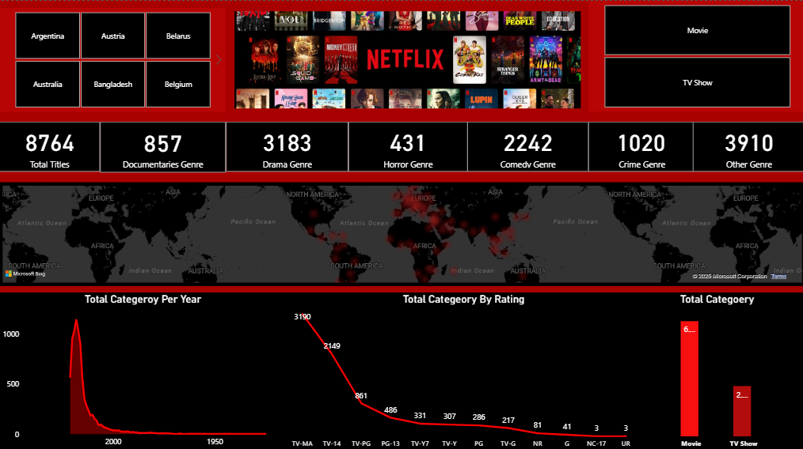
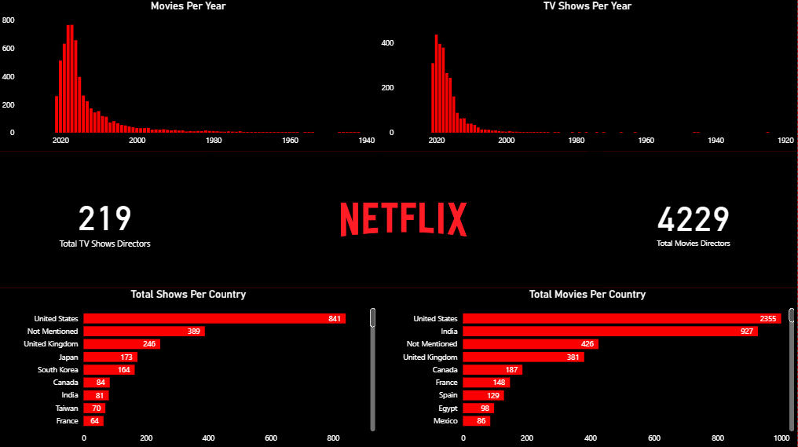

# 🎬 Netflix Dashboard (Power BI + SQL)

  
  
  

---

## 🖤 Project Overview  
This project is an **end-to-end analysis of Netflix data** using **Power BI for visualization** and **SQL for data processing**.  
The dashboards are fully interactive and highlight **trends, genres, countries, directors, and ratings**.  

Below you can see both dashboards 👇 (no external links required).  

---

## 📊 Dashboard 1 – Netflix Content Overview  

  

🔎 **What this page shows:**  
- **KPIs** → Total Titles (8764), Drama (3183), Comedy (2242), Crime (1020), Documentaries (857), Horror (431), Other Genres (3910).  
- **Global Distribution** → World map showing Netflix content presence.  
- **Categories per Year** → Growth of content over time.  
- **Ratings Breakdown** → Popularity of maturity ratings (TV-MA, TV-14, PG, etc.).  
- **Movies vs TV Shows** → Movies (~6000+) dominate over TV Shows (~2000+).  

---

## 📊 Dashboard 2 – Country & Director Insights  

  

🔎 **What this page shows:**  
- **Movies Per Year** → Peak content releases between 2015–2020.  
- **TV Shows Per Year** → Big growth from 2010 onwards.  
- **Director Insights** → 4229 Movie Directors & 219 TV Show Directors.  
- **Top Countries for Content**:  
  - 🎬 **Movies** → USA (2355), India (927), UK (381), Canada (187), France (148).  
  - 📺 **TV Shows** → USA (841), UK (246), Japan (173), South Korea (164), India (81).  

---

## ⚡ Tools & Technologies  
- 🎨 **Power BI** → Dashboard design, data visualization.  
- 🗄️ **SQL** → Data cleaning, joins, transformations.  
- 🔍 **Business Intelligence** → Insights, KPIs, and storytelling.  

---

  💡 *Anyone can immediately see both dashboards and understand Netflix insights at a glance.*  

